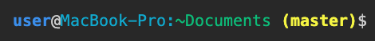
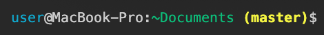

# Terminal Bash on macOS

## ``` Steps to edit your bash_profile```
* Move to  user directory <code>cd ~</code>
* Open editor <code>open -e .bash_profile</code>
* Write below steps
* Save your code in your editor <code>Ctrl+S</code>
* Refresh terminal <code>. .bash_profile</code> or close & open new window

## ``` Add current branch on terminal ```
```
# Git Branch

parse_git_branch() {
  git branch 2> /dev/null | sed -e '/^[^*]/d' -e 's/* \(.*\)/ (\1)/'
}
```

## ``` Colorize your terminal ```
Suggestion

>Code
```
# Add Color to Folders

USER='\033[01;34m\]\u\[\033[01;m\]@'
HOST='\[\033[36m\]\h:\[\033[m\]'
CURRENT_DIR='\[\033[32m\]\w\[\033[33;1m\]'
BRANCH='$(parse_git_branch)\[\033[m\]'

export PS1="$USER$HOST$CURRENT_DIR$BRANCH\$ "

export CLICOLOR=1
export LSCOLORS=ExFxBxDxCxegedabagacad
alias ls='ls -GFh'
```
>Result



Alternative 1

>Code
```
USER='\033[01;34m\]\u\[\033[01;m\]'
HOST='\[\033[36m\]@\h:\[\033[m\]'
CURRENT_DIR='\[\033[32m\]\w\[\033[33;1m\]'
BRANCH='$(parse_git_branch)\[\033[m\]'

export PS1="$USER$HOST$CURRENT_DIR$BRANCH\$ "
```
>Result


Alternative 2

>Code
```
USER='\[\033[36m\]\u\[\033[m\]@'
HOST='\h:'
CURRENT_DIR='\[\033[32m\]\w\[\033[33;1m\]'
BRANCH='$(parse_git_branch)\[\033[m\]'

export PS1="$USER$HOST$CURRENT_DIR$BRANCH\$ "
```
>Result



