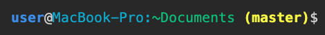
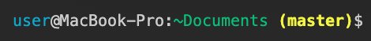

# Terminal Bash on macOS

### Steps to edit your bash_profile
* Move to  user directory `cd ~`
* Open editor `open -e .bash_profile`
* Write below steps
* Save your code in your editor `Ctrl+S`
* Refresh terminal `. .bash_profile` or close & open new window

### Add current branch on terminal
```
# Git Branch

parse_git_branch() {
  git branch 2> /dev/null | sed -e '/^[^*]/d' -e 's/* \(.*\)/ (\1)/'
}
```

### Colorize your terminal
Suggestion

>Code
```
# Add Color to Folders

USER='\033[01;34m\]\u\[\033[01;m\]@'
HOST='\[\033[36m\]\h:\[\033[m\]'
CURRENT_DIR='\[\033[32m\]\w\[\033[33;1m\]'
BRANCH='$(parse_git_branch)\[\033[m\]'

export PS1="$USER$HOST$CURRENT_DIR$BRANCH\$ "

export CLICOLOR=1
export LSCOLORS=ExFxBxDxCxegedabagacad
alias ls='ls -GFh'
```
> 

Alternative 1

>Code
```
USER='\033[01;34m\]\u\[\033[01;m\]'
HOST='\[\033[36m\]@\h:\[\033[m\]'
CURRENT_DIR='\[\033[32m\]\w\[\033[33;1m\]'
BRANCH='$(parse_git_branch)\[\033[m\]'

export PS1="$USER$HOST$CURRENT_DIR$BRANCH\$ "
```
> 

Alternative 2

>Code
```
USER='\[\033[36m\]\u\[\033[m\]@'
HOST='\h:'
CURRENT_DIR='\[\033[32m\]\w\[\033[33;1m\]'
BRANCH='$(parse_git_branch)\[\033[m\]'

export PS1="$USER$HOST$CURRENT_DIR$BRANCH\$ "
```
> 
